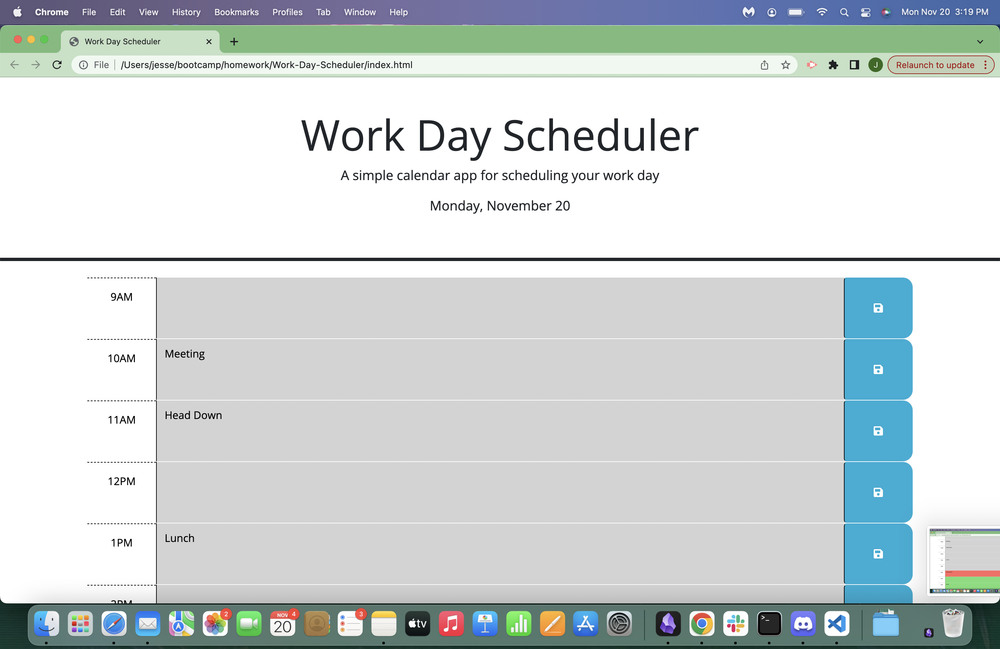
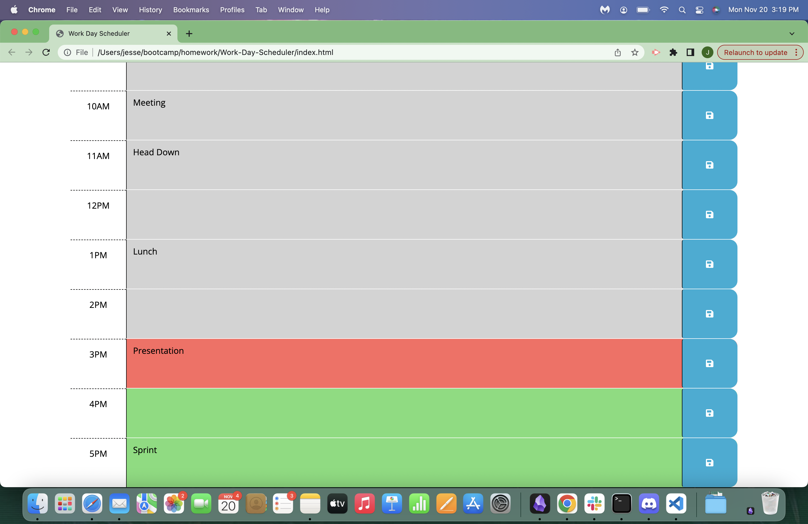

# Work Day Scheduler
A simple calendar app for scheduling your work day.

## Description

This is an app that allows you to record their schedule for your work day. You can save the events to your localstorage, so when you come back to the page, your schedule will still be there. If the event is in the future the block will be green, if it is in the current hour it will be red, if it is in the past it will be gray.   

This application is built primarily with JavaScipt. It was an exercise in using the Third Party API dayjs, and implementing jQuery and Bootstrap for creating and styling elements in my project. 

Enjoy!

## Screenshots

## Resources
Thank you [DayJS](https://day.js.org)

## [Click here to view my project!](https://jessebradbury.github.io/Work-Day-Scheduler/)